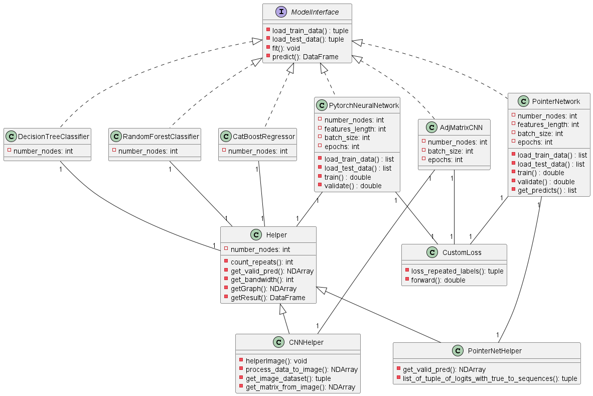

# Graph structured data

Research on the application of neural models to learn representation from graphs.

## Bandwidth minimization

The bandwidth minimization problem consists in relabeling the Nodes in a Graph, in a way that when this graph is represented in a form of an adjacency matrix, the non-zero values are near the main diagonal.

### Folder structure

The following tree presents the folder structure of the project. The "datasets" folder holds the ".g6" and ".csv" files as the datasets. examples/bandwidth/Datasets holds the datasets split into training, validation, and testing as well as Jupyter Notebooks related to that. Models and ModelsUnified hold the different models used throughout the research. "opt_results" and "txt_graphs_files_example" are folders used by the "opt_band_example.py" and "build_dataset_v2_example.py", generally speaking, they read the ".g6" files, uses CPLEX Optimizer to the get optimal labeling and builds a ".csv" file representing the datasets with the features being the flattened upper triangle matrix of a graph and the labels being the optimal sequence of labels.

```bash
├───...
├───datasets
│   ├───examples
│   └───graph6
│       ├───n10_blocks
│       ├───n3_blocks
│       ├───n5_blocks
│       ├───n7_blocks
│       └───n9_blocks
├───...
├───examples
│   ├───bandwidth
│   │   ├───...
│   │   ├───Datasets
│   │   ├───Models
│   │   ├───ModelsUnified
│   │   ├───opt_results
│   │   │   └───n5_blocks
│   │   └───txt_graphs_files_example
│   └───...
├───...
```

### Getting started

- **The first step requires a Ubuntu/Linux machine**

1 - Execute **opt_band_example.py** (with numbers 3, 5, or 7 as required CLI argument, exact_bandwidth is set up for 10 nodes) to calculate the optimal band of the Graph.

```bash
$ python opt_band_example.py 5 Y
```

2 - Execute **build_dataset_v2_example.py** to build the opt_band_n_nodes_graph_example.csv dataset. Each sample is the flattened upper triangular matrix of the graph.

```bash
$ python build_dataset_v2_example.py 5 0
```

The dataset will be stored in "csv" files, in the folder "datasets/examples"

### About the data

All the data came from a C library, Nauty and Traces, this software generates the ".g6" files, a ".g6" file is considered a block of graphs. The python library, `NetworkX`, handles reading that data, thus each block is a `list` of graphs. Each graph in that list is unique in terms of its structure, which means all graphs are non-isomorphic, and the blocks are different from each other as well.

Graphs with less number of nodes, like 3 nodes, 5 nodes, 7 and 9, only have 1 block (one ".g6" file) containing a list of graphs, for 10 nodes, since we are handling a large number of Graphs, the files were partitioned, all the python scripts are suited to handle multiple ".g6" files for a specific number of nodes.

To get started with the data, we recommend taking a look at the bandwidth_visualizer.ipynb notebook.

### opt_band_example.py

This file will generate txt files wherein each file represents a graph, in the "txt_graphs_files_example" folder. This is required since a C software, CPLEX Optimizer (`MBandwidth`), uses these files to return the optimal sequence of a Graph. The output of this software is under the "opt_results/n_blocks". Thus, the optimal exact sequences for all non-isomorphic graphs of 5 nodes are stored in the "optimalSequencse_n5_0.g6.txt file" under the "opt_results/n5_blocks", for example. Therefore, this python script is responsible for building graphs represented as text graphs and optimalSequences_nodes_block.g6.txt for each block.

To be executed requires the number of nodes for all non-isomorphic graphs with n nodes and a flag to start a clean execution, deleting old files and generating new ones. It only executes on a Ubuntu/Linux machine since it uses the "MBandwidth" binary.

Usage example, for 5 nodes:

```shell
python opt_band_example.py 5 Y
```

### build_dataset_v2_example.py

This python file uses the optimalSequences_nodes_block.g6.txt files that were generated by opt_band_example.py, this is required to build the dataset. Using this data, it builds a CSV file in "../../datasets/examples/opt_band_n_nodes_graph.csv". This script is responsible for building the dataset to be used by the Neural Network, implemented with PyTorch.

Note that, if there is no optimalSequences_nodes_block.g6.txt under the respective folder, an error will raise.

The first CLI argument is the number of nodes and the second, 1 or 0, is the verbose flag option.

Usage example, for 5 nodes:

```shell
python build_dataset_v2_example.py 5 0
```

Once the data is created, we can execute the "getDatasets.ipynb" Jupyter Notebook in the examples/bandwidth/Datasets folder, it splits the data into training, validation and testing data.

### Models and ModelsUnified folder

Throughout the research, it was used a variety of models for solving the bandwidth minimization problems, such as Multilayer Perceptron, Convolutional Neural Networks, pix2pix, Pointer Network, etc. The performance, in terms of minimizing the bandwidth of a matrix, is compared among the models. In order to organize the project, it was created an "Interface" with two methods "predict" and "fit", every Model in the Models folder fills up that contract. It's analogous to the ModelsUnified folder, this one is used in the context of models configured to deal with graphs of different lengths.

The following image shows the Models diagram:



### Packages and libraries required

First step is to set up a conda environment:

Go to https://www.anaconda.com/products/distribution and download the linux distribution, once the file is download execute with `$ bash Anaconda3-2022.05-Linux-x86_64.sh`.

Pytorch:

```bash
# https://pytorch.org/get-started/locally/
conda install pytorch torchvision torchaudio cudatoolkit=10.2 -c pytorch
```

Tensorflow:

```bash
conda install -c conda-forge tensorflow
```

Networkx, pandas, numpy:

```
conda install -c anaconda networkx
conda install pandas
conda install -c anaconda numpy
```

scikit-learn:

```
conda install -c conda-forge scikit-learn
```
